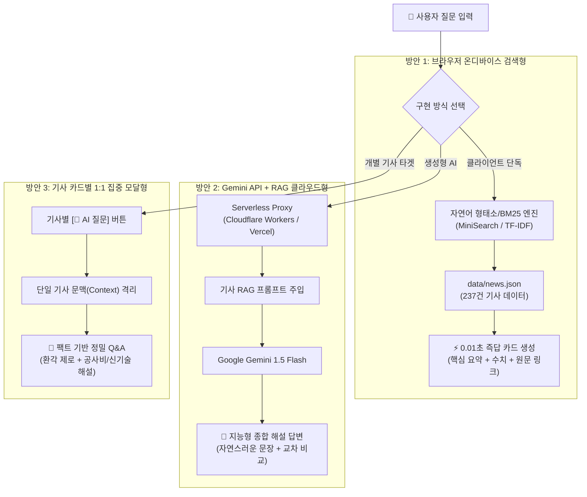

# 🤖 Civil News Hub: 토목 뉴스 기사 Q&A 챗봇 구현 방안 종합 분석

본 문서는 **Civil News Hub(토목 뉴스 브리핑 & 채용·공모전 올인원 허브)**에 사용자가 기사 내용에 대해 자유롭게 질문하고 답변을 받을 수 있는 **기사 기반 Q&A 챗봇**을 탑재하기 위한 3가지 최적의 구현 방식과 상세 장단점을 분석한 제안서입니다.

---

## 🏗️ 1. 아키텍처 개요 및 3가지 접근 방식

---

## 📌 2. 구현 방식별 상세 비교

### 방안 1. 브라우저 온디바이스 검색 기반 경량 챗봇 (Zero-Server / Instant RAG)

> **"서버 비용 0원, GitHub Pages 정적 배포 환경에 즉시 탑재 가능한 실시간 검색형 어시스턴트"**

- **작동 원리**:
  1. 사용자가 우측 하단 플로팅 챗봇 아이콘을 누르고 질문을 입력합니다. (예: *"최근 GTX-A 관련 예산이나 개통 일정 알려줘"*, *"지하안전법 관련 기사 있어?"*)
  2. 브라우저 메모리에 이미 로드된 `news.json`의 237개 기사 데이터(제목, AI 3줄 요약, 본문 키워드, 카테고리)를 대상으로 순수 자바스크립트 형태소/BM25 알고리즘이 실시간 일치도를 계산합니다.
  3. 가장 연관도가 높은 상위 1~3개 기사의 핵심 수치와 AI 3줄 요약을 조합하여 챗봇 말풍선 카드 형태로 즉시 답변합니다.
- **장점**:
  - **유지비 0원 & 영구 무료**: OpenAI나 Google Gemini API를 호출하지 않으므로 트래픽이 아무리 늘어나도 비용이 발생하지 않습니다.
  - **GitHub Pages 100% 최적화**: 별도의 클라우드 서버나 서버리스 함수 배포 없이 프론트엔드 코드(`app.js`)만으로 즉각 완성됩니다.
  - **초고속 반응 속도 (10ms 이내)**: 네트워크 대기 시간이나 LLM 토큰 생성 딜레이 없이 엔터를 치는 즉시 답변이 렌더링됩니다.
  - **보안성 최고**: API Key를 사용하지 않으므로 키 유출, 탈취, 악용 위험이 전혀 없습니다.
- **단점**:
  - 생성형 AI(ChatGPT)처럼 새로운 문장을 창작하거나 깊은 인과관계를 추론하지 못하고, 기사에 적힌 팩트와 요약문을 발췌·조합하여 답변합니다.
  - "이 공법과 저 공법의 기술적 장단점을 비교해줘"와 같은 심층 기술 토론에는 한계가 있습니다.

---

### 방안 2. Google Gemini 1.5 Flash API + 서버리스 RAG 챗봇 (Full Generative AI)

> **"실제 최신 생성형 AI가 토목 전문 연구원처럼 문맥을 완벽히 이해하고 대화해 주는 프리미엄 챗봇"**

- **작동 원리**:
  1. 사용자의 질문이 들어오면 질문과 관련된 기사 본문 3~5건을 추출하여 프롬프트의 문맥(`Context`)으로 삽입합니다.
  2. GitHub Pages의 정적 한계를 극복하고 API Key를 안전하게 보호하기 위해 무료 서버리스(Cloudflare Workers 또는 Vercel Functions) 프록시를 통해 `Google Gemini 1.5 Flash` 모델에 전송합니다.
  3. AI가 기사 내용을 꼼꼼히 읽고 사용자의 의도에 꼭 맞춘 유려하고 전문적인 문장 형태의 종합 답변을 생성합니다.
- **장점**:
  - **압도적인 답변 퀄리티**: 단순 검색을 넘어 여러 기사의 내용을 교차 비교하고, 질문자가 궁금해하는 핵심을 콕 집어 친절하게 설명합니다.
  - **풍부한 토목 전문 지식 결합**: 기사 텍스트에 더해 LLM이 이미 학습한 토목 공학 기본 지식(시방서 기준, 터널 굴착 공법 특성 등)을 함께 융합하여 설명할 수 있습니다.
  - **자연스러운 연속 대화(Multi-turn)**: "그럼 착공은 언제인데?", "공사비는 어디서 조달해?" 등 앞선 대화 맥락을 기억하며 대화를 이어나갈 수 있습니다.
  - **무료 티어 활용 가능**: Gemini 1.5 Flash는 분당 15회 호출(RPM 15)까지 완전 무료이므로 포트폴리오 및 개인 사이트 운영에 최적입니다.
- **단점**:
  - **프록시 서버 1회 배포 필요**: GitHub Pages에 API Key를 하드코딩하면 보안상 위험하므로 무료 서버리스 프록시 세팅이 필요합니다. (대안: 사용자가 본인의 Gemini API Key를 1회 입력하게 하는 방식도 가능)
  - **생성 대기 시간 발생**: LLM이 답변을 생성하고 스트리밍하는 데 약 1.5초~2.5초의 딜레이가 있습니다.

---

### 방안 3. 기사 카드별 1:1 문맥 집중형 모달 챗봇 (Context-Bound Quick QA)

> **"기사를 읽던 흐름 그대로, 특정 기사 1건을 핀셋 지정하여 질문하는 컴팩트 심층 Q&A"**

- **작동 원리**:
  1. 전체 사이트 대상 플로팅 챗봇 대신, 각 뉴스 카드 하단에 **`[🤖 이 기사 AI 질문]`** 버튼을 배치합니다.
  2. 버튼을 누르면 기사 전용 Q&A 모달이 열리며, 자주 묻는 프리셋 칩들이 즉시 제안됩니다:
     - 💬 *"이 사업의 총공사비와 완공 목표일은?"*
     - 💬 *"적용된 토목 신기술 및 핵심 공법은?"*
     - 💬 *"관련 법령 개정안이나 안전 규제 이슈는?"*
  3. 사용자가 프리셋을 누르거나 직접 질문을 입력하면, 오직 해당 1건의 기사 본문만을 문맥으로 삼아 답변을 출력합니다.
- **장점**:
  - **환각 현상(Hallucination) 제로**: 질문의 범위가 오직 '선택한 1개 기사'로 엄격히 제한되므로 다른 기사와 혼동하거나 잘못된 정보를 말할 위험이 없습니다.
  - **사용자 경험(UX) 최적화**: 토목 뉴스 독자는 보통 특정 흥미로운 기사를 읽다가 모르는 용어나 사업 규모가 궁금해지므로, 실제 뉴스 소비 패턴에 가장 잘 부합합니다.
  - **API 토큰 소모 최소화**: 기사 1건(약 500~1,000자)만 전달하므로 속도가 매우 빠르고(1초 미만) 무료 할당량을 거의 소모하지 않습니다.
- **단점**:
  - "이번 주 토목 뉴스 전체 트렌드 알려줘"처럼 여러 기사를 종합 분석하는 형태의 질문은 불가능합니다.
  - 기사 카드마다 버튼 공간을 일부 차지합니다.

---

## 📊 3. 종합 비교 매트릭스

| 평가 기준            |       방안 1: 온디바이스 검색형       | 방안 2: Gemini RAG 클라우드형 | 방안 3: 기사별 1:1 모달형  |
| :--------------- | :-------------------------: | :--------------------: | :----------------: |
| **답변 스타일**       |      핵심 팩트 발췌 & 카드 매칭       |    🌟 유려한 생성형 AI 문장    | 🎯 정밀한 단일 기사 심층 해설 |
| **인프라/서버**       | **불필요 (GitHub Pages 100%)** |     무료 서버리스 프록시 1개     | 프록시 or 클라이언트 직접 호출 |
| **운영 비용**        |       **0원 (영구 무료)**        |  무료 티어 (Gemini Flash)  |  무료 티어 (토큰 최소 소비)  |
| **응답 속도**        |        **즉시 (10ms)**        |       1.5 ~ 2.5초       |     0.8 ~ 1.2초     |
| **보안 안전성**       |         최고 (키 불필요)          |       프록시 분리 필요        |     프록시 분리 필요      |
| **환각(거짓 정보) 위험** |         없음 (원문 기반)          |      낮음 (RAG 주입)       |   **원천 차단 (0%)**   |
| **구현 난이도**       |      🟢 쉬움 (JS 파일 1개)       |   🟡 보통 (프록시 + 스트리밍)   |  🟢 쉬움/보통 (모달 UI)  |

---

## 🎯 4. 추천 로드맵 (단계별 추천)

1. **1단계 (가장 추천: 방안 1 도입)**
   - 백엔드 배포나 API Key 발급 없이 **오늘 즉시 우측 하단에 귀여운 토목 챗봇 위젯**을 띄울 수 있습니다.
   - 사용자가 "철도", "가덕도", "지하안전" 등을 물어보면 237개 기사 중 핵심 내용 3개를 깔끔한 말풍선과 링크로 즉각 답변해 줍니다.
2. **2단계 (고도화: 방안 1 + 방안 2 하이브리드)**
   - 평소에는 빠른 '방안 1'의 로컬 검색으로 즉시 답하고, 사용자가 *"AI로 더 깊게 물어보기"*를 누르면 Gemini API와 연결하여 심층 답변을 작성하는 하이브리드 방식으로 확장할 수 있습니다.
