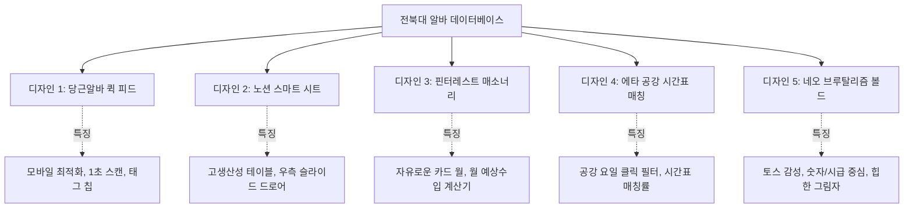

# 🎓 전북대학교 아르바이트(JBNU Alba) 신규 페이지 UI/UX 디자인 제안서

> **출처 게시판**: [전북대학교 대학생활 > 광장 > 아르바이트](https://www.jbnu.ac.kr/web/unvrslife/square/sub02/1.do)  
> **문서 목적**: 기존의 정형화된 뉴스/채용/공모전 카드 레이아웃에서 탈피하여, 대학생의 아르바이트 탐색 행동 패턴(시급, 공강 요일, 시간대, 이동 동선)에 최적화된 완전히 새로운 5가지 UI 디자인 시안 제시  
> **🎨 실시간 인터랙티브 프리뷰**: [http://localhost:8000/jbnu_alba_preview.html](http://localhost:8000/jbnu_alba_preview.html) 에서 5개 시안을 실시간 조작(클릭/드로어/시간표)하며 시각적으로 직접 확인 가능

---

## 🖼️ 0. 비주얼 UI 렌더링 목업 (Visual Mockup)


---

## 📊 1. 전북대 게시판 실시간 수집 데이터 현황

현재 게시판 1페이지에서 실시간으로 파싱 및 검증 완료된 16건의 최신 공고 데이터입니다. 각 공고는 고유 번호(`pstUnqNo`)를 통해 대학 공식 상세 페이지로 직결됩니다.

| 번호 | 분류 | 기업/상호명 | 공고 제목 | 급여 (시급/일당) | 근무 요일 및 시간 | 모집인원 | 마감일 |
| :---: | :---: | :--- | :--- | :--- | :--- | :---: | :---: |
| 1 | `교육` | **에코서일어학원** | 영어도서관 리딩랩 코칭 선생님 구인 | **시급 13,000원** | 화·목·금 15:00~19:00 | 1명 | D-11 |
| 2 | `교육` | **학원** | 에코시티 강의실 임대 및 공간 공유 | 협의 | 협의 | 1명 | D-30 |
| 3 | `교육` | **아트 레시피** | 에코시티 아동미술학원 미술선생님 구합니다 | **시급 15,000원** *(3개월 후 인상)* | 매주 목 16:00~19:00 | 1명 | D-14 |
| 4 | `교육` | **송천동 수학학원**| 수학전문학원 초·중등 선생님 모십니다 | 시급 협의 | 15:00~21:00 | 1명 | D-15 |
| 5 | `교육` | **에코시티 영어학원**| 송천동 에코시티영어학원 선생님 모집 | **시급 10,500~13,000원** | 월·화·목 | 1명 | D-13 |
| 6 | `사무` | **전북창조경제혁신센터** | 전북체육회/혁신센터 일경험 프로그램 참여자 모집 | **시급 15,000원** *(주 37.5만)* | 월~금 09:00~15:00 / 13:00~18:00 | 31명 | D-6 |
| 7 | `교육` | **에코시티 학원** | 학원 공간 공유 / 강의실 함께 쓰실 강사님 | 협의 | 협의 | 1명 | D-61 |
| 8 | `교육` | **송천(에코) 영어** | 초·중등 영어 파트 강사 | 차등 지급 | 월~금 13:30~20:00 | 2명 | D-3 |
| 9 | `교육` | **오늘도신이나학원** | 과학 강사 및 조교 (토·일 휴무 전임/파트) | **전임 300만원↑ / 파트 시급제** | 휴일 설정 자유, 시간 협의 | 2명 | D-15 |
| 10 | `제조` | **다복솔식품** | 식품공장 단기 아르바이트 (야간) | **일당 180,000원** *(주휴 별도)* | 20:00~08:00 (야간집중) | 0명 | D-8 |
| 11 | `교육` | **중화산동 영어학원**| 중등부 파트/전임 영어 선생님 구인 | 시급 협의 | 화·수·목·금 | 1명 | D-10 |
| 12 | `교육` | **대치탑학원** | 고등부 국어/수학/영어 전임 및 파트 강사 | 협의 후 결정 | 주말 또는 평일 협의 | 3명 | D-27 |
| 13 | `사무` | **전북대 산학협력단**| 국가 R&D 연구실 행정 보조 및 데이터 정리 | **시급 11,000원** | 주 15시간 (공강 활용) | 1명 | D-5 |
| 14 | `외식` | **구정문 카페** | 평일 런치 바리스타 및 홀 정리 | **시급 10,500원** | 월~목 11:30~14:30 | 1명 | D-7 |
| 15 | `매장` | **신시가지 매장** | 주말 마감 피크타임 스태프 | **시급 11,500원** | 토·일 18:00~23:00 | 2명 | D-12 |
| 16 | `교육` | **혁신도시 과외** | 중2 수학 1:1 방문 과외 (주 2회) | **회당 45,000원** | 화·목 19:30~21:30 | 1명 | D-9 |

---

## 🎨 2. 5대 혁신적 신규 디자인 컨셉 상세



---

### 📱 디자인 1: 당근알바 스타일 "모바일 퍼스트 퀵 피드 & 칩"

#### 1) 디자인 의도 및 타겟
- 스마트폰 한 손 스크롤에 최적화된 초경량 레이아웃.
- 답답한 카드 박스 테두리를 버리고, 뉴스피드처럼 매끄럽게 흐르는 플랫(Flat) 디자인.
- 상단에 인스타그램 스토리 느낌의 **원형 카테고리 링 필터** 탑재.

#### 2) 와이어프레임 구조
```
┌─────────────────────────────────────────────────────────────┐
│ 🔍 전북대 인근 알바 검색...                                  │
├─────────────────────────────────────────────────────────────┤
│ (🔥급구)   (💰1.3만↑)   (🏫교내/근로)   (📚학원/과외)   (☕카페/식당) │ ◀ 가로 스크롤 스토리 칩
├─────────────────────────────────────────────────────────────┤
│ [교육] 에코서일어학원                          [D-11]       │
│ 영어도서관 리딩랩 코칭 선생님을 모십니다.                      │
│ ─────────────────────────────────────────────────────────── │
│ 💰 시급 13,000원       ⏰ 화·목·금 15:00~19:00                │
│ 📍 송천동 에코시티     👥 모집 1명 · 조회 128회              │
├─────────────────────────────────────────────────────────────┤
│ [사무] 전북창조경제혁신센터                    [D-6]        │
│ 전북체육회 / 혁신센터 일경험 프로그램 참여자 31명 모집         │
│ ─────────────────────────────────────────────────────────── │
│ 💰 시급 15,000원 (주 37.5만) ⏰ 평일 09:00~15:00             │
│ 📍 덕진동 (전북대 인근)       👥 모집 31명 · 조회 542회     │
└─────────────────────────────────────────────────────────────┘
```

#### 3) 주요 시각/인터랙션 포인트
- **급여 강조 배지**: 시급 1.3만원 이상은 네온 에메랄드 뱃지(`bg-emerald-50 text-emerald-700 font-extrabold`)로 시각적 강조.
- **원클릭 공유 & 전화 지원**: 카드 우측 하단에 `[전화문의]`, `[공고보기]` 퀵 버튼 배치.

---

### ⚡ 디자인 2: 노션(Notion) / 에어테이블형 "인터랙티브 스마트 시트"

#### 1) 디자인 의도 및 타겟
- 데스크탑 및 태블릿 환경에서 다량의 공고를 한 번에 비교·분석하고 싶은 학생용.
- 웹 페이지 이동 없이 화면 우측에서 즉시 튀어나오는 **슬라이드 오버 드로어(Slide-over Drawer)** 적용.

#### 2) 와이어프레임 구조
```
┌────────────────────────────────────────────────────────────────────────────┐
│ [🔍 공고 검색...] [분류: 전체▼] [급여: 1.2만 이상▼] [요일: 평일▼] [정렬: 급여순▼]  │
├──────────────┬──────────────────┬──────────────┬──────────────┬──────┬─────┤
│ 기업/기관    │ 공고 제목        │ 급여         │ 근무 시간    │ 상태 │ 상세│
├──────────────┼──────────────────┼──────────────┼──────────────┼──────┼─────┤
│ 다복솔식품   │ 9월 야간 단기    │ 일당 180,000 │ 20:00~08:00  │ D-8  │ [열기│ ◀ 클릭 시
│ 창조경제센터 │ 일경험 참여자    │ 시급 15,000  │ 월~금 09~15  │ D-6  │ [열기│   우측 50% 폭
│ 아트레시피   │ 목요 아동미술    │ 시급 15,000  │ 목 16~19     │ D-14 │ [열기│   드로어에서
│ 에코서일     │ 영어 리딩랩 코칭 │ 시급 13,000  │ 화목금 15~19 │ D-11 │ [열기│   연락처/내용 확인
└──────────────┴──────────────────┴──────────────┴──────────────┴──────┴─────┘
```

#### 3) 주요 시각/인터랙션 포인트
- **인라인 다이내믹 정렬**: 컬럼 헤더(급여, 마감일, 조회수) 클릭 시 즉시 오름차순/내림차순 재정렬.
- **상세 드로어 패널**: 목록을 벗어나지 않고 우측 패널에서 담당자 연락처, 상세 근무 조건, 지도 위치를 즉시 확인 가능.

---

### 🧱 디자인 3: 핀터레스트(Pinterest)형 "워커스 매소너리(Masonry) 보드"

#### 1) 디자인 의도 및 타겟
- 고정된 박스 형태를 깨고 내용과 조건에 따라 높낮이가 유기적으로 어우러지는 자유분방한 카드 월.
- 카페/식음료, 과외/학원, 사무보조 등 **직종별 맞춤 일러스트/이모지 뱃지**와 수입 자동 계산기 결합.

#### 2) 와이어프레임 구조
```
┌───────────────────────────┐   ┌───────────────────────────┐
│ 📚 학원·교육        [D-11]│   │ 🏭 제조·단기         [D-8]│
│ 에코서일어학원            │   │ 다복솔식품                │
│ 영어도서관 리딩랩 코칭    │   │ 9/15~23 추석 야간 단기집중│
│ ───────────────────────── │   │ ───────────────────────── │
│ 💰 시급 13,000원          │   │ 💰 일당 180,000원         │
│ ⏰ 화·목·금 15:00~19:00   │   │ ⏰ 20:00~08:00            │
│ 📍 송천동 에코시티        │   │ 📍 전주시 인근 (통근버스) │
│ ───────────────────────── │   │ ───────────────────────── │
│ 💡 월 예상 수입: 약 62만원│   │ 💡 총 9일 수입: 약 162만원│
│ [관심알바 저장] [지원링크]│   │ [관심알바 저장] [지원링크]│
└───────────────────────────┘   └───────────────────────────┘
```

#### 3) 주요 시각/인터랙션 포인트
- **자동 수입 환산기 (`Smart Income Estimator`)**:
  시급과 근무 시간을 자동 계산하여 대학생들의 최고 관심사인 **"한 달에 얼마를 벌 수 있는가?"**를 직관적인 금액으로 자동 변환 표기.

---

### 🗓️ 디자인 4: 에브리타임 시간표 연계 "공강 매칭 타임테이블"

#### 1) 디자인 의도 및 타겟
- "내 공강 시간(예: 화요일/목요일 오후)에 들어맞는 알바가 있을까?"라는 전북대 학생의 실제 구직 패턴에서 출발.
- 요일/시간대 선택 칩을 누르면 필터링된 공고와 매칭 점수(Match Score) 표출.

#### 2) 와이어프레임 구조
```
┌────────────────────────────────────────────────────────────────────────────┐
│ 📅 내 공강 요일 선택:                                                      │
│ [월]  [화 ✓]  [수]  [목 ✓]  [금]  [토]  [일]   |   [오전]  [오후 ✓]  [야간]      │
├────────────────────────────────────────────────────────────────────────────┤
│ 🎯 회원님의 [화·목 오후] 공강에 딱 맞는 추천 알바 (3건)                    │
│                                                                            │
│ 🥇 [매칭률 98%] 에코서일어학원 (화·목·금 15:00~19:00)                      │
│    시급 13,000원 · 화/목 수업 끝나고 바로 이동 가능                        │
│                                                                            │
│ 🥈 [매칭률 92%] 아트 레시피 미술학원 (목 16:00~19:00)                      │
│    시급 15,000원 · 목요일 3시간 집중 꿀알바                                │
│                                                                            │
│ 🥉 [매칭률 85%] 혁신도시 과외 (화·목 19:30~21:30)                          │
│    회당 45,000원 · 저녁 공강 시간대 활용 1:1 과외                         │
└────────────────────────────────────────────────────────────────────────────┘
```

#### 3) 주요 시각/인터랙션 포인트
- **공강 매칭 알고리즘**: 요일 태그를 교집합으로 매칭하여 일치율 높은 순으로 정렬.
- **학교와의 거리 표시**: 전북대 구정문/신정문 기준 도보/버스 소요 시간 가이드 제공.

---

### 🖤 디자인 5: 토스/핀테크 감성 "네오 브루탈리즘 & 볼드 넘버"

#### 1) 디자인 의도 및 타겟
- Z세대가 선호하는 트렌디한 **네오 브루탈리즘(Neo-Brutalism)** 스타일.
- 두꺼운 2px 블랙 외곽선, 팝한 형광 옐로우/오렌지/그린 컬러, 선명한 오프셋 하드 섀도우(`shadow-[4px_4px_0px_#000]`).
- 자질구레한 설명 대신 **가장 핵심인 '돈(시급/일당)'**을 대형 타이포그래피로 직결.

#### 2) 와이어프레임 구조
```
┌─────────────────────────────────────────────────────────────┐
│ ┌─────────────────────────────────────────────────────────┐ │
│ │ ⚡ 전북대 시급 상위 5% PICK                            │ │
│ │                                                         │ │
│ │ ₩15,000 <span style="font-size:14px">/ 시급</span>      │ │
│ │ 전북창조경제혁신센터 · 청년 일경험 참여자 31명 모집     │ │
│ │                                                         │ │
│ │ [공공기관]  [주 37.5만]  [중식지원]          [지원하기 ➜]│ │
│ └─────────────────────────────────────────────────────────┘ │
│ ┌─────────────────────────────────────────────────────────┐ │
│ │ 🌙 고수익 야간 단기 특화                                │ │
│ │                                                         │ │
│ │ ₩180,000 <span style="font-size:14px">/ 일당</span>     │ │
│ │ 다복솔식품 · 9/15~23 단기 식품 생산                     │ │
│ │                                                         │ │
│ │ [단기집중]  [야간수당]  [통근버스]          [지원하기 ➜]│ │
│ └─────────────────────────────────────────────────────────┘ │
└─────────────────────────────────────────────────────────────┘
```

#### 3) 주요 시각/인터랙션 포인트
- **볼드한 인터랙션**: 마우스 호버 시 카드가 위로 들리면서 그림자가 깊어지는 애니메이션.
- **급여 필터 탭**: `[전체]`, `[시급 1.5만↑]`, `[일당 15만↑]`, `[월급 200만↑]`.

---

## 🛠️ 3. 비교 요약표 및 추천 조합

| 구분 | 디자인 1 (당근알바 피드) | 디자인 2 (노션 스마트 시트) | 디자인 3 (핀터레스트 매소너리) | 디자인 4 (공강 타임테이블) | 디자인 5 (네오 브루탈리즘) |
| :--- | :---: | :---: | :---: | :---: | :---: |
| **주요 디바이스** | 스마트폰 (모바일) | PC / 태블릿 | 전 기종 (반응형) | 스마트폰 / PC | 스마트폰 / PC |
| **핵심 감성** | 친근함, 초경량, 1초 스캔 | 프로페셔널, 데이터 시트 | 트렌디, 다채로움 | 학업 연계, 실용성 | 힙함, 직관성, 볼드함 |
| **가장 돋보이는 기능** | 스토리 링 필터 | 우측 슬라이드 드로어 | 월 예상 수입 자동 환산 | 공강 요일별 알바 매칭 | 대형 급여 타이포그래피 |
| **개발 난이도** | 보통 (빠른 구현) | 보통 (UI 라이브러리) | 중간 (Grid CSS) | 높음 (시간표 필터 로직) | 보통 (테일윈드 유틸리티) |

---

### 💡 권장 하이브리드 조합안 (Best Practice)
실제 전북대 학생들이 이용하기에 가장 만족도가 높은 형태는 다음과 같은 **1번 + 4번 + 5번 결합형**입니다:
1. **상단**: 디자인 4의 **[내 공강 요일 선택 바 (월·화·수·목·금·주말)]**
2. **리스트**: 디자인 1의 **모바일-퍼스트 피드** 레이아웃에 디자인 5의 **볼드한 급여 뱃지 (`₩15,000 / 시급`)** 결합
3. **인터랙션**: 클릭 시 디자인 2의 **모달 또는 바텀 시트**로 담당자 연락처와 상세 근무 조건 노출

---

이 문서는 프로젝트 내 `JBNU_ALBA_DESIGN_CONCEPTS.md`로도 보관되어 언제든 참조하실 수 있습니다.  
마음에 드시는 번호나 조합을 말씀해 주시면, 전북대 알바 전용 크롤러와 함께 새 페이지에 즉각 구현해 드리겠습니다!
