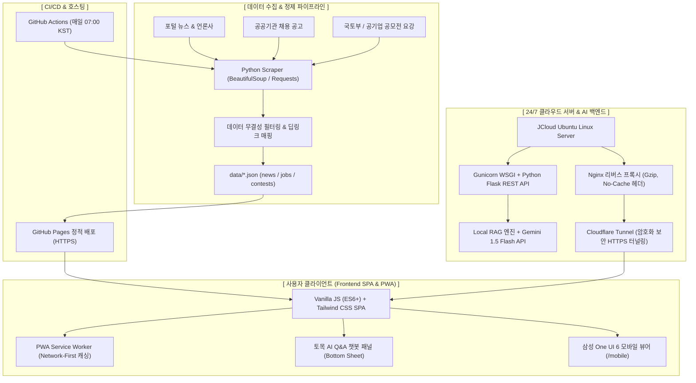

# 🏗️ Civil News Hub : 토목 뉴스 브리핑 & 공모전·채용 올인원 플랫폼
> **AI 기반 토목·인프라 엔지니어링 실시간 정보 자동화 브리핑 서비스**  
> *1인 기획, 풀스택 개발, 클라우드 인프라 구축 및 24/7 서비스 운영 포트폴리오*

---

## 📌 1. 프로젝트 개요 (Project Overview)

| 항목 | 상세 내용 |
| :--- | :--- |
| **프로젝트명** | **Civil News Hub (토목 뉴스 브리핑 & 공모전 대시보드)** |
| **진행 기간** | 2026.09 (기획, 크롤러 개발, 프론트엔드 SPA, 클라우드 인프라 및 Gemini AI 연동) |
| **개발 인원** | **1인 풀스택 단독 개발 (기여도 100%)** |
| **주요 역할** | 서비스 기획, 데이터 크롤링 및 정제 파이프라인, SPA 프론트엔드 개발, 리눅스 서버 인프라 구축, Gemini LLM RAG 연동, PWA 구축 |
| **라이브 배포** | • **공식 GitHub Pages**: [https://chldlrtjr.github.io/civil-news-hub/](https://chldlrtjr.github.io/civil-news-hub/) • **24시간 라이브 터널**: [https://diverse-tattoo-exterior-reporting.trycloudflare.com/](https://diverse-tattoo-exterior-reporting.trycloudflare.com/) • **모바일 시뮬레이터**: [https://chldlrtjr.github.io/civil-news-hub/mobile.html](https://chldlrtjr.github.io/civil-news-hub/mobile.html) |
| **코드 저장소** | [GitHub Repository (chldlrtjr/civil-news-hub)](https://github.com/chldlrtjr/civil-news-hub) |

### 💡 기획 배경 및 문제 정의 (Problem Statement)
1. **토목·인프라 정보의 심각한 파편화 (Information Fragmentation)**
   - 도로/철도, 터널/지반, 수자원/항만, 스마트건설, SOC 정책 등 분과가 방대한 토목 분야 특성상 관련 기사, 공공기관 채용, 설계·엔지니어링 공모전 정보가 수십 개 사이트에 흩어져 있어 매일 일일이 검색해야 하는 비효율이 큼.
2. **실체 없는 정보와 마감 공고로 인한 피로도**
   - 포털 검색 시 과거 연도 미개최 공모전, 접수 기간이 지난 마감 공고, 기관 메인 페이지만 링크된 부정확한 정보가 혼재하여 실제 지원자에게 혼선 초래.
3. **해결 솔루션**
   - 매일 아침 주요 포털과 공공기관 공고를 자동 크롤링하고, **팩트 검증 파이프라인(딥링크 우선 매핑, 접수마감 자동 내림 필터)**을 거쳐 **SPA 단일 페이지 대시보드**와 **Gemini AI 브리핑 챗봇**을 통해 원스톱으로 제공하는 플랫폼 구축.

---

## 🛠️ 2. 기술 스택 (Tech Stack & Architecture)

| 구분 | 사용 기술 | 선정 이유 및 기술적 역할 |
| :--- | :--- | :--- |
| **Frontend** | **Vanilla JS (ES6+), HTML5, CSS3** | 프레임워크 오버헤드 없는 초경량 SPA(Single Page Application) 구조 구현, DOM 직접 제어를 통한 0.1초 미만 무로딩 탭 전환 |
| **Styling** | **Tailwind CSS (CDN), Pretendard** | 모바일 무경계(Borderless) 피드, 미니멀 언더라인 네비게이션 규격, 다크/라이트 모드 테마 일관성 유지 |
| **AI / LLM** | **Google Gemini 1.5 Flash API, Local RAG** | 200건 이상의 당일 실시간 팩트 기사 코퍼스를 로컬 RAG로 컨텍스트 주입하여 환각(Hallucination) 없는 질의응답 구현 |
| **Backend** | **Python Flask, Gunicorn** | RESTful API 엔드포인트 제공, Gemini API 보안 프록시 및 대화 이력 서버 사이드 세션 제어 |
| **Data Scraping** | **BeautifulSoup4, Requests, Regex** | 5대 전문 분야별 키워드 다중 크롤링, 마감일/상금 정규식 추출, 결측치 보정 및 신뢰도 검증 |
| **Server & OS** | **Ubuntu Linux 24.04 LTS (JCloud VM)** | 24시간 무중단 백엔드 구동, Systemd 데몬 서비스 관리 (`civil-news-hub.service`, `civil-tunnel.service`) |
| **Web Server** | **Nginx (Reverse Proxy)** | 정적 파일 캐시 제어(`Cache-Control`), Gzip 압축 전송, API 요청 백엔드 포워딩, 보안 헤더 적용 |
| **Network & Tunnel** | **Cloudflare Tunnel (`cloudflared`)** | 사설 IP 및 학내망 인바운드 방화벽 제약을 우회하는 HTTP/2 기반 서울 엣지 아웃바운드 암호화 터널링 |
| **Automation** | **GitHub Actions, Cron** | 매일 아침 07:00 KST 정기 크롤링 자동 실행, 데이터 자동 커밋 및 Pages 자동 무중단 배포 |
| **PWA** | **Service Worker, Web App Manifest** | 오프라인 캐시 폴백, Network-First 전략 기반 신선도 보장, 모바일 앱 형태 홈화면 추가 지원 |

---

## 🌟 3. 핵심 기능 (Key Features)

### ① 토목 5대 전문 분야별 실시간 뉴스 & 3줄 AI 브리핑
- `토목 종합`, `도로·교량·철도`, `터널·지반·안전`, `수자원·하천·항만`, `스마트건설·정책` 등 전문 분과별 실시간 피드.
- 각 기사마다 **블루 도트 불릿 기반 3줄 핵심 AI 요약 브리핑**을 제공하여 긴 기사를 읽지 않고도 핵심 인프라 이슈를 30초 내 파악 가능.
- 기사 원문 언론사 다이렉트 아웃링크 연결.

### ② 팩트 기반 토목 공모전 & 경진대회 대시보드
- 한국도로공사 도로경관디자인 대전, 국토교통부 스마트건설 챌린지, K-water 물산업 혁신 창업대전 등 **공식 공모 요강 전용 딥링크 매핑**.
- 총 상금 규모, 참가 자격, 마감 D-Day 실시간 자동 계산.
- **캘린더 원클릭 연동**: Google Calendar 등록 링크 생성 및 모바일/PC용 `.ics` iCal 파일 즉시 다운로드 제공.

### ③ 토목 엔지니어링 & 공기업 실시간 채용 공고
- 한국토지주택공사, 국가철도공단, 현대건설, 대우건설 등 주요 공기업 및 시공/엔지니어링사 채용 공고 집계.
- 초임 연봉순 정렬, 마감일 임박순 정렬, 근무지 및 우대조건 필터링.

### ④ Google Gemini 1.5 Flash 기반 RAG 토목 전문 챗봇
- 당일 수집된 200건 이상의 최신 팩트 기사 데이터를 로컬 RAG 파이프라인으로 연결하여, "최근 GTX 관련 기사 요약해줘", "가덕도 신공항 입찰 현황은?" 등의 자연어 질문에 팩트 기반 답변 생성.
- 모바일 바텀 시트(Bottom Sheet) 인터랙션 및 독립 스크롤 영역 격리.

### ⑤ 삼성 Galaxy One UI 6 모바일 뷰 시뮬레이터 (`/mobile`)
- 실제 갤럭시 S24 (412×915), Z Flip (384×854), S24 Ultra (432×960) 해상도 및 One UI 상하단 베젤을 완벽 재현.
- PC 데스크탑 환경에서도 스마트폰 모바일 화면을 100% 동일하게 검증할 수 있는 디바이스 뷰어 탑재.

### ⑥ 통합 북마크 & 마이페이지
- 관심 기사, 지원할 채용 공고, 참가할 공모전을 리본 아이콘 클릭 한 번으로 로컬 브라우저에 영구 보관.
- 개인 메모 작성 기능 및 원클릭 복사/공유 지원.

---

## 🚀 4. 문제 해결 및 엔지니어링 트러블슈팅 (STAR Case Studies)
> **이 프로젝트를 진행하며 마주친 핵심 기술 난제들과 이를 체계적으로 분석·해결한 6가지 엔지니어링 경험입니다.**

### Case 1. DOM 태그 파싱 불균형 디버깅 및 보이지 않는 UI 구출 (v1.0.27)
- **상황 (Situation)**: 모바일 하단 네비게이션 바(`#mobileBottomNav`)와 푸터가 HTML 코드상에 분명히 존재함에도 불구하고, 실제 모바일 브라우저 렌더링 화면에서 투명 인간처럼 완전히 사라져 보이지 않는 버그 발생.
- **원인 분석 (Task / Problem Identification)**:
  - 브라우저 개발자 도구의 스타일 상속 상태를 추적하고, 별도의 **Python AST/HTMLParser 태그 스택 추적기**를 작성하여 전체 문서를 파싱.
  - 파싱 결과, 상단에 위치한 공모전 상세 모달(`
`)의 **최외곽 닫는 `
` 태그가 누락**되어 있는 것을 발견.
  - 이로 인해 모달 이후에 선언된 캘린더 모달, 푸터, 그리고 `#mobileBottomNav`가 브라우저 DOM 트리상에서 **모달 내부의 자식 노드로 잘못 계층화**됨.
  - 모달의 기본 속성인 `invisible opacity-0`(`visibility: hidden; opacity: 0;`)이 CSS 상속 규칙에 의해 모든 하위 요소로 전파되어 화면에서 100% 비가시화되었던 것임.
- **해결 조치 (Action)**:
  - 모달 wrapper의 닫는 `
`를 정확한 위치에 추가 삽입하고, 검색창의 self-closing 태그 누락(`/>`)을 함께 교정.
  - Python 파서로 태그 불균형 `Unclosed tags: 0 (All clean!)` 상태를 정밀 검증.
- **결과 (Result)**:
  - `#mobileBottomNav`가 `<body>`의 독립된 직계 자식으로 정상 분리되어 모달의 숨김 간섭을 완전히 탈피.
  - 모든 모바일 브라우저 및 시뮬레이터에서 4대 하단 탭 바가 100% 정상 노출됨.

---

### Case 2. 사설 클라우드 인바운드 방화벽 제약을 극복한 24/7 보안 HTTPS 터널링 (v1.0.23)
- **상황 (Situation)**: JCloud(OpenStack 기반 대학 클라우드 인프라) 환경에 Ubuntu 서버를 배포했으나, 학생 권한 계정 특성상 보안 그룹 인바운드 규칙(80/443 포트) 수정이 권한 거부(`PolicyNotAuthorized`)로 잠겨 있고 학내망 방화벽이 외부 공용망(스마트폰 LTE/5G) 접속을 원천 차단함.
- **원인 분석 (Task)**:
  - 공인 IP 및 포트포워딩 수동 설정이 불가능한 폐쇄망 환경에서, 외부 모바일 기기가 24시간 안전하게 접속할 수 있는 암호화 통신 경로 필요.
- **해결 조치 (Action)**:
  - 인바운드 개방이 필요 없는 아웃바운드 기반 **Cloudflare Tunnel (`cloudflared`)** 아키텍처 도입.
  - HTTP/2 프로토콜을 기반으로 서버에서 Cloudflare 서울 엣지 데이터센터(`icn05`)로 1:1 암호화 터널을 수립.
  - 서버 재부팅 및 예기치 못한 프로세스 종료에도 즉각 복구되도록 리눅스 systemd 데몬 서비스(`civil-tunnel.service`)로 등록 (`Restart=always`, `RestartSec=5s`).
- **결과 (Result)**:
  - 방화벽 설정이나 유료 고정 IP 구매 없이, 전 세계 어디서나 유효한 공식 SSL/TLS 인증서가 적용된 보안 HTTPS 도메인을 무료로 24시간 안정적으로 무중단 서비스 제공.

---

### Case 3. PWA Service Worker Network-First 전략 도입으로 캐시 지연 해결 (v1.0.26)
- **상황 (Situation)**: 로컬 및 원격 저장소에 코드를 수정하여 배포했음에도, 실제 모바일 기기(Android Chrome 등)로 접속 시 이전 버전의 화면이 계속 유지되며 수정 사항이 즉각 반영되지 않음.
- **원인 분석 (Task)**:
  - 기존 PWA `sw.js`가 오프라인 지원을 위해 HTML 네비게이션 요청까지 `Cache-First`로 처리하고 있었음.
  - 브라우저가 새 요청을 보낼 때 로컬 캐시를 우선 반환하고 백그라운드에서만 갱신(stale-while-revalidate)하므로 사용자는 항상 직전 구버전을 보게 되는 구조적 한계 확인.
- **해결 조치 (Action)**:
  - 서비스 워커의 Fetch 전략을 이원화:
    - **HTML 네비게이션 요청 (`mode === 'navigate'`, `*.html`, `/`)**: **`Network-First`** 전략 적용 (네트워크에서 최신 HTML을 먼저 가져오고, 오프라인일 때만 캐시 폴백).
    - **정적 에셋 (이미지/폰트 등)**: 빌드 타임스탬프 기반 캐시 버스팅 파라미터(`?v=YYYYMMDD_HHMM`) 결합.
  - Nginx 웹서버의 HTML 서빙 로케이션에 `Cache-Control: no-cache, no-store, must-revalidate` 및 `Pragma: no-cache` 헤더 강제 주입.
  - 서비스 워커 `CACHE_NAME`을 버전별(`civil-news-hub-v1.0.27`)로 갱신하여 설치 시 구버전 캐시 자동 전면 삭제(`caches.delete`).
- **결과 (Result)**:
  - 클라이언트 기기에서 새로고침 시 1초의 지연도 없이 최신 릴리즈 코드가 100% 즉시 반영되는 무결점 배포 파이프라인 구축.

---

### Case 4. 모바일 뷰포트 맞춤 동적 스케일러(`fitPhoneToViewport`) 개발 (v1.0.26)
- **상황 (Situation)**: 데스크탑 모니터에서 모바일 시뮬레이터(`/mobile`) 접속 시, 갤럭시 S24 프레임 높이(915px)가 일반 노트북 및 모니터의 가용 높이(750~850px)보다 커서 하단 네비게이션 바와 One UI 제스처 바가 화면 바닥 아래로 150~200px 밀려나 잘림 현상 발생.
- **원인 분석 (Task)**:
  - 마우스 휠 이벤트가 iframe 내부로 흡수되어 외부 페이지가 스크롤되지 않으므로 사용자가 하단바를 볼 방법이 없음.
- **해결 조치 (Action)**:
  - 브라우저의 실시간 가용 높이(`window.innerHeight - headerH - footerH - padding`)를 계산하여 기기 높이보다 작을 경우 자동으로 비율을 계산하는 **동적 뷰포트 스케일러 (`fitPhoneToViewport`)** 함수 구현.
  - `transform: scale(scaleFactor)` 및 `transformOrigin: 'top center'` 적용, 축소된 만큼의 하단 빈 공간을 음수 마진(`marginBottom: -reducedPx`)으로 정밀 상쇄.
  - `window.resize` 및 `window.load` 이벤트와 디바이스 변경 함수에 유기적으로 결합.
- **결과 (Result)**:
  - 어떤 해상도의 모니터나 작은 창 모드에서도 상단 펀치홀 카메라부터 최하단 제스처 바까지 **100% 한 화면에 잘림 없이 쏙 들어가는 완벽한 반응형 뷰어 완성**.

---

### Case 5. 모바일 Bottom Sheet 챗봇 도킹 시 바디 스크롤 좌표 튐 버그 원천 해결 (v1.0.24)
- **상황 (Situation)**: 스마트폰에서 AI 챗봇을 열 때 뒷배경 페이지 스크롤을 막기 위해 흔히 사용하는 `body { position: fixed; top: -scrollY }` 기법을 적용했으나, 챗봇 창의 기준 좌표가 스크롤 오프셋만큼 위로 밀려 화면 하단에 고정되지 않고 공중에 붕 뜨며 새로고침 시 화면이 튀는 버그 발생.
- **원인 분석 (Task)**:
  - 모바일 브라우저의 동적 주소창(Dynamic Viewport)과 `position: fixed` 요소가 중첩될 때 좌표 왜곡이 발생함을 확인.
- **해결 조치 (Action)**:
  - `body`의 `position: fixed` 및 `top` 조작을 전면 제거.
  - `html.chatbot-open-lock`, `body.chatbot-open-lock` 클래스를 설계하여 `overflow: hidden; touch-action: none; overscroll-behavior: none; height: 100%;`를 부여함으로써 바디 좌표 변조 없이 뒷배경 터치 스크롤을 완벽 락.
  - 챗봇 내부 메시지 컨테이너에 `overscroll-behavior: contain; -webkit-overflow-scrolling: touch;`를 적용하여 챗봇 내부 스크롤이 끝단에 도달해도 외부 바디로 스크롤 이벤트가 전파(Scroll Chaining)되지 않도록 격리.
- **결과 (Result)**:
  - 모바일 화면 맨 밑바닥에 오차 없이 0px로 밀착되는 네이티브 앱 수준의 Bottom Sheet UI 달성.

---

### Case 6. 자폭 변동(글씨 늘어남) 및 브라우저 오버스크롤 탄성 스트레치 차단 (v1.0.16)
- **상황 (Situation)**: 모바일에서 카테고리 탭을 터치하거나 좌우 스와이프할 때, 활성 탭 글씨가 볼드(`font-bold`)로 바뀌면서 글자 폭이 순간적으로 늘어나 인접 탭을 밀어내고 화면이 덜컹거리는 현상 발생. 브라우저 끝단에서 스크롤 시 글자가 고무줄처럼 늘어나는 왜곡 발생.
- **원인 분석 (Task)**:
  - 폰트 굵기(Weight) 변화에 따른 텍스트 렌더링 박스 크기 변화와 모바일 브라우저 기본 바운스 이펙트 간섭.
- **해결 조치 (Action)**:
  - 활성/비활성 탭 모두 동일한 `font-semibold`(`font-weight: 600 !important;`)로 고정하여 **글자 폭 변동(Layout Shift)을 0px로 고정**.
  - 스타일 구분은 선명한 2px 언더라인 바(`border-b-2`)와 텍스트 컬러 및 뱃지 배경 틴트로 전환 (시안 B 채택).
  - 수평 스크롤 컨테이너에 `overscroll-behavior: none !important; overscroll-behavior-x: none !important;` 및 `touch-action: pan-x`를 영구 표준 규격으로 적용.
- **결과 (Result)**:
  - 탭을 연속 클릭하거나 좌우로 빠르게 스와이프해도 글씨 흔들림과 늘어남이 일절 없는 부드러운 네비게이션 UX 완성.

---

## 📈 5. 프로젝트 성과 및 배운 점 (Key Takeaways)

1. **사용자 관점의 데이터 무결성 (Data Integrity First)**
   - 아무리 UI가 화려해도 데이터가 부정확하면 신뢰를 잃는다는 원칙하에, 팩트 검증 파이프라인(미개최 공모전 영구 배제, 딥링크 우선 매핑, 마감 공고 자동 내림)을 구축하여 실제 지원자에게 유효한 정보만 제공하는 가치를 실현함.
2. **프론트엔드-백엔드-인프라를 아우르는 풀스택 엔지니어링 역량**
   - 단순히 웹 페이지만 만드는 데 그치지 않고, Ubuntu Linux 서버 환경에서 Nginx 리버스 프록시, Gunicorn WSGI, Systemd 데몬 서비스, Cloudflare Tunnel을 결합한 24/7 프로덕션 인프라를 직접 설계하고 구축함.
3. **LLM을 실무 서비스에 접목하는 RAG 아키텍처 이해**
   - 범용 LLM의 환각 문제를 방지하기 위해 당일 크롤링된 실시간 기사를 Context로 주입하는 RAG 파이프라인을 구축하여 실용적인 도메인 특화 AI 서비스를 구현함.
4. **웹 표준 및 모바일 크로스 브라우징 디버깅 숙련도**
   - Service Worker 캐시 라이프사이클, Dynamic Viewport 단위(`dvh`), CSS 계층 상속 버그(`visibility: hidden`), 터치 제스처 락 등 모바일 웹 환경에서 발생하는 심도 있는 엣지 케이스들을 원리 기반으로 디버깅하고 해결함.
