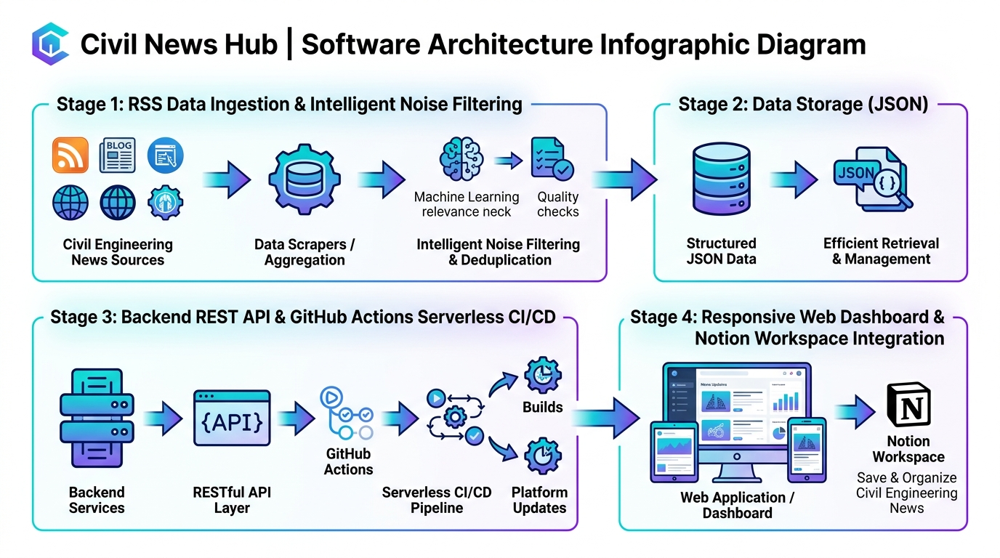

# 🏗️ 토목 뉴스 브리핑 (Civil News Hub)

매일 아침 인터넷에 올라오는 토목(도로·철도·교량, 터널·지반, 수자원·하천, 스마트건설 등) 관련 기사를 자동으로 수집하고, 편리하게 링크를 클릭하여 확인할 수 있는 **반응형 웹 대시보드**입니다.

> 💼 **Notion 포트폴리오**: [토목 뉴스 & 공모전 자동화 브리핑 허브 포트폴리오 보기](https://app.notion.com/p/3d5009a14e198038ba3ff62b74d18e03)



---

## 🌟 주요 기능

1. **자동 수집 & 카테고리 분류**:
   - `토목 종합`: 토목, 토목공학, 토목건설, 인프라 구축 등
   - `도로·교량·철도`: 도로공사, 교량공사, 철도건설, 지하철, 고속도로, GTX 등
   - `터널·지반·안전`: 터널공사, 지반침하, 지하안전평가, 싱크홀, 연약지반 등
   - `수자원·하천·항만`: 하천정비, 댐건설, 항만공사, 수자원, 방파제 등
   - `스마트건설·정책`: 스마트건설, 건설신기술, 국토교통부 SOC, BIM 등
2. **원클릭 다이렉트 링크**: 클릭 한 번으로 해당 언론사/포털의 원문 기사로 즉시 이동.
3. **실시간 검색 & 필터**: 원하는 키워드(예: "GTX", "싱크홀", 특정 건설사 등) 즉시 검색.
4. **북마크 (⭐ 스크랩)**: 보관하고 싶은 기사를 별표 버튼으로 저장 (브라우저 로컬 저장).
5. **원터치 새로고침**: 상단 [최신 수집] 버튼을 누르면 실시간으로 최신 기사를 즉시 다시 긁어옴.
6. **다크 / 라이트 모드**: 아침 눈부심을 줄여주는 다크 모드 기본 지원.
7. **모바일 & PC 반응형 UI**: 스마트폰에서도 앱처럼 깔끔하게 사용 가능.

---

## 🚀 로컬에서 실행하는 방법

### 방법 1. 윈도우 원클릭 실행 (가장 쉬운 방법)
* 폴더 안에 있는 **`run.bat`** 파일을 더블클릭합니다.
* 자동으로 서버가 켜지며 웹 브라우저(`http://localhost:8000`)가 열립니다.

### 방법 2. 터미널 명령어로 실행
```bash
# 최신 기사 수집 및 웹 서버 동시 실행
python app.py
```
브라우저에서 `http://localhost:8000` 으로 접속하시면 됩니다.

---

## ⚙️ 키워드 및 언론사 커스터마이징 방법

원하는 키워드를 추가하거나 제외하고 싶으시면 **`scraper.py`** 파일을 열어 자유롭게 수정할 수 있습니다.

```python
# scraper.py 상단의 CATEGORIES 부분에서 검색어를 추가/수정:
CATEGORIES = [
    {
        "id": "road_rail",
        "name": "도로·교량·철도",
        "queries": ["도로공사", "교량공사", "철도건설", "지하철공사", "고속도로건설", "GTX 착공", "원하는키워드추가"],
        "badge_color": "emerald"
    },
    ...
]
```

수정 후 상단의 **[최신 수집]** 버튼을 누르거나 `python scraper.py`를 실행하면 즉시 반영됩니다.

---

## ☁️ 매일 아침 7시 무료 자동 실행 (GitHub Actions)

내 컴퓨터를 매일 아침 켜두지 않아도 매일 자동으로 기사를 수집하도록 하려면:

1. 본 프로젝트를 사용자의 **GitHub 저장소**에 업로드(Push)합니다.
2. 저장소의 `Settings` -> `Pages`에서 `Source`를 **Deploy from a branch**로 설정하고, `/root` 경로를 선택합니다.
3. `.github/workflows/daily_crawl.yml`에 의해 **매일 한국 시간 아침 7시(UTC 22:00)**에 자동으로 파이썬 스크립트가 실행되어 기사를 업데이트합니다.
4. 배포된 GitHub Pages 주소를 스마트폰 홈 화면에 바로가기로 추가하면 **완전한 무료 모바일 앱**처럼 사용하실 수 있습니다!
